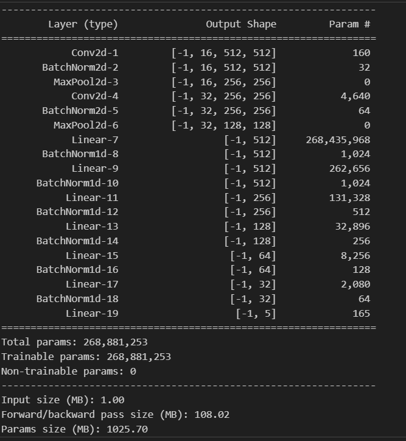

# CNN Movie Poster Classifier

This model is a simple implementation of a Convolutional Neural Network (CNN) architecture for classifying grayscale images into 5 different classes.

## 🔧 Model Architecture

The model utilizes 2 convolutional layers followed by several fully connected layers, incorporating batch normalization and ReLU/Sigmoid activation functions.

Below is the general architecture of the model:

  
<!-- *Gambar ini harus disimpan di `assets/model_architecture.png`* -->

---

## 📦 Pre-trained Weights

You can download the pre-trained model weights from the following link:

🔗 [Download Weights](https://simpan.ugm.ac.id/s/DAFm1xPixsM0s3x)

---

## 🧪 Example Inference Results

Below are some example predictions generated by the model on test images:

### Example 1

### Example 2

### Example 3

